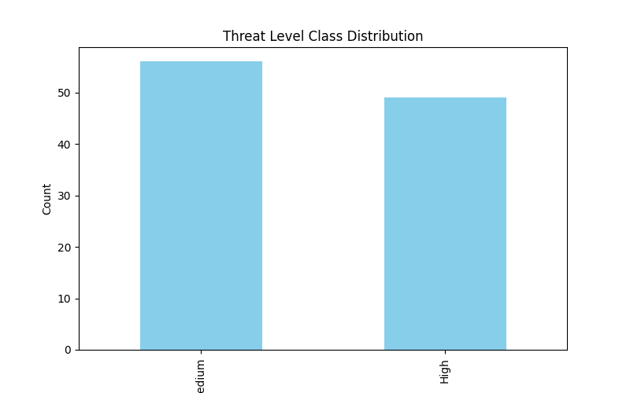
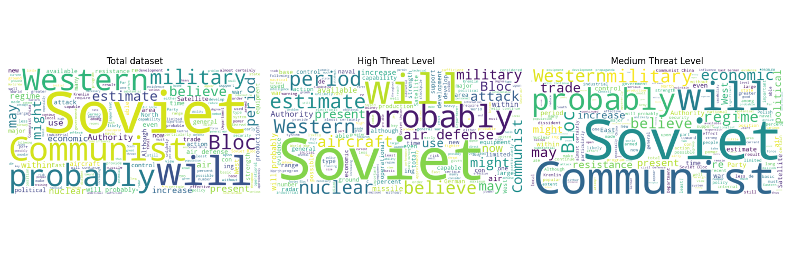
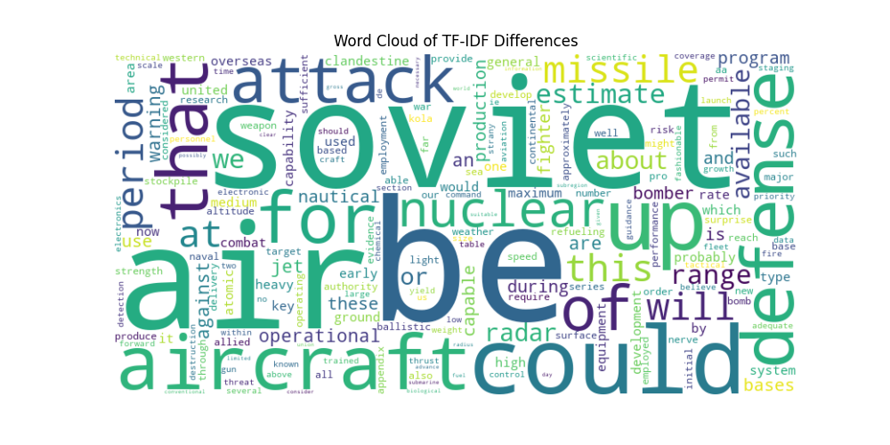
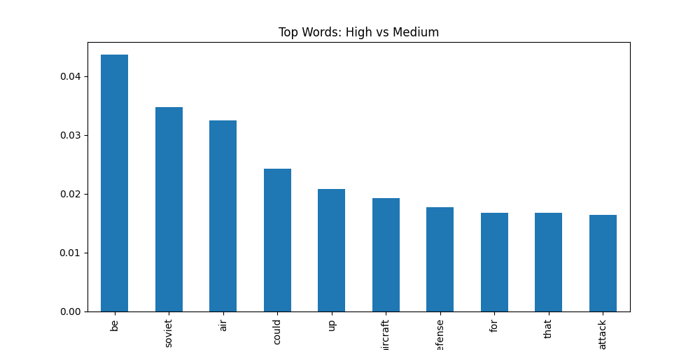

# Declassified CIA intelligence Reports 
## Executive Summary

Defence intelligence is rapidly becoming a game played by computers. There are huge advantages to this, computers can sift through intelligence that takes a human analyst days in just seconds. Faster insights are often more actionable insights. These systems however, are being developed in complete secrecy. Here inlies a problem, secrecy is a petri dish for bias. To try and counter this I have collated this list of reports to examine biases of data likely to be used to train these types of models. 
Potential applications of this dataset could be models to predict the threat level of a problem given the evidence provided, or examinations of language used in defence intelligence and how it contributes to threat level classification.

## Previous Datasets

If these exist they are extraordinarily difficult to find. I looked quite carefully and couldnt find any. This dataset is unique in hosting the reports in a single location and being user friendly. The reports are also labelled with a threat level which was entirely my own generation.

## Data Description

 **Doc Title**  
When the report is downloaded from the national archives website this is the name it is given by default, this could be used for classification of NIE vs SNIE but really its there if you want to dowload the data from the source and join this data easily.
 **Title**  
This is the title of the report, This usually summarises the problem the report is looking into.
 **Threat Level**  
This dataset consists of hand labelled threat levels into two catagories, 'medium' and 'high'. I initially planned to have three catagories, 'low', 'medium', and 'high'. I quickly discovered that reports are not commissioned for low threat level concerns. Yes I read every report and designated a threat level, yes it took ages. 
 **Text**  
This is the extracted text from the pdf documents, this text was then cleaned and spellchecked to make sure its as readable as possible, however it's still a little messy. 

## Exploratory Data Analysis
Through no intention of mine, the classes actually ended up being reasonably balanced.

For a really birdseye view of the the dataset I created some very simple word-clouds to explore patterns in the dataset, and differences between classes. Soviet is by far the most obvious feature of these wordclouds, a product of the datasets time period. It does seem interesting that 'communist' is such a large presence in the medium classification, perhaps indicating that the non Soviet communist powers were seen as weaker at the time. The word 'nuclear' is also only visible in the High classification cloud. This suggests that this may have beena  differentiator of threat classification. Contrastingly 'economic' is only visible in the medium classification, suggesting these threats are not viewed as important.

I tried to do an analysis of what actually differed between high and medium threat levels. For this I used TF-IDF (Term Frequency-Inverse Document Frequency). This is a technique used to measure the importance of words in a class relative to another class. here's a word cloud of High threat compared to Medium threat (bigger words means more likely to be classified as High). Soviet and air stand out, perhaps suggesting anxieties about Soviet air capabilities. 

Over interpretation should be tempered however, because the actual values for these words are extremely low. This does not mean the analysis is worthless, but ti does suggest there is more complexity to classification than simply just individual words, its more likely interactions between words.

## Ethics Statement

**Intended Usage** 
This dataset is intended to be used for demonstration purposes only. This should absolutely not be used to train models that are deployed in any real world environment for actual intelligence analysis. Any models trained on this data should be for academic purposes only.

**Potential Biases** 
Since the dataset was hand labelled by myself, the resulting data could easily exhibit my own biases. My educational background is western centric, many of the events discussed I have the benefit of hindsight, and I am not a qualified intelligence analyst. I did my best to consult with analysts but I may be relying on more verbose evidence patterns or simply the writing style of particular analysts. 
It should also be noted that all the documents here had to be declassified in order for me to access them, thus there is a blindspot for anything the CIA has not approved for declassification. The dataset is also a product of its time, most reports are extremely hostile to much of the Eastern hemisphere due to Soviet influence over the region at the time.

**Limitations** 
There are currently only around 100 reports in this database. I am committed to expanding this database as and when possible, there are around 1500 reports available online. I believe it is important to hand label them as using LLMs for this task would slightly defeat the point of creating the database. This is however the reason for only 100 being available as of this moment, it can take between 10 minutes and an hour to read a report and decide on a threat level.  

### Links
[Github](https://github.com/recozers/Defence-Intelligence)  
[Kaggle](https://www.kaggle.com/datasets/stuartbladon/declassified-cia-intelligence-reports/data)

### License

This dataset is licensed under the Creative Commons Attribution-NonCommercial 4.0 International License (CC BY-NC 4.0). To view a copy of this license, visit https://creativecommons.org/licenses/by-nc/4.0/.

### Notes
Power analysis not included given non-specific target metrics and also given the 'ongoing' nature of the project. More data is almost certainly needed but I am limited in my capacity to read intelligence reports.